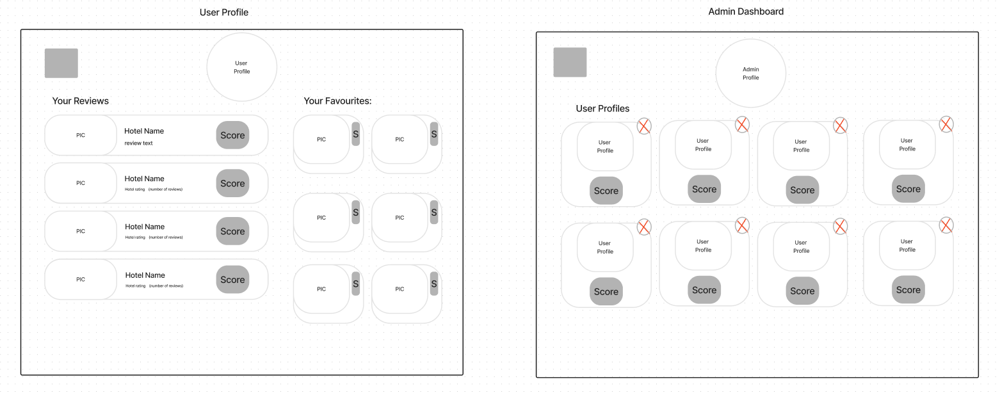

# Sentiment Analysis for Booking.com Reviews

## Description

A web application that provides insights into the sentiment of accommodation reviews on Booking.com, helping users make informed decisions.

## Context

**Problem**: Alot of users often struggle to quickly gauge the overall sentiment of accommodation reviews on Booking.com, leading to time-consuming and sometimes ineffective decision-making processes.

**Solution**: By providing a summarised sentiment analysis of reviews, users can easily understand the general sentiment of accommodations and make more informed choices.

**Intended Users:**

- Travelers looking for accommodations.
- Booking.com users wanting a quick sentiment overview of reviews.
- Users wishing to contribute their own reviews.

## Features

**Sentiment Analysis:** Analyse and display the sentiment of reviews from Booking.com.

**CRUD Operations:**

- **Create:** Users can add their reviews.
- **Read:** Users can view accommodation details, including reviews and their sentiment analysis and overall sentiment score for accomodations.
- **Update:** Users can update their own reviews.
- **Delete:** Users can delete their own reviews.
- **Admin:** Admin can manage all reviews and users.
- **User Authentication and Authorisation:**
  Sign up, log in, and log out functionality.
  Role-based access control (Admin and Regular User).

## User Interface

- **Home Page**: Overview of the application with a search bar to find accommodations.
- **Accommodation Page**: Displays sentiment analysis of reviews for a - selected accommodation.
- **User Profile**: Allows users to manage their profiles and reviews.
- **Admin Dashboard**: Admin functionalities to manage reviews, and users.

### Wireframes:

## Architecture:

## RESTful Routing

| Route                   | HTTP Method | Headers       | Payload                                         | Response                             |
| ----------------------- | ----------- | ------------- | ----------------------------------------------- | ------------------------------------ |
| /api/accommodations     | GET         | Authorisation | None                                            | List of accommodations               |
| /api/accommodations/:id | GET         | Authorisation | None                                            | Accommodation details with sentiment |
| /api/reviews/:accId     | GET         | Authorisation | None                                            | List of reviews with sentiment       |
| /api/reviews            | POST        | Authorisation | { text: String, rating: Number, accId: String } | Created review                       |
| /api/reviews/:id        | PUT         | Authorisation | { text: String, rating: Number }                | Updated review                       |
| /api/reviews/:id        | DELETE      | Authorisation | None                                            | Deleted review                       |
| /api/auth/signup        | POST        | None          | { username: String, password: String }          | User signup confirmation             |
| /api/auth/login         | POST        | None          | { username: String, password: String }          | JWT token                            |
| /api/users              | GET         | Authorisation | None                                            | List of users                        |
| /api/users/:id          | DELETE      | Authorisation | None                                            | Deleted user                         |

## Technologies

**Frontend:**

- React
- Axios
- Tailwind

**Backend:**

- Node.js
- Express.js
- MongoDB
- Mongoose
- Natural (for sentiment analysis)
- JWT

**Testing:**

- Frontend - react testing library, vitest
- Backend - Supertest, sinon and chai

## Deployment

- **Frontend Deployment**: Netlify.
- **Backend Deployment:** onRender.
- **Database Deployment:** MongoDB Atlas.

**Environment Variables:**

- **MONGO_URI:**
- **JWT_SECRET**
- **API_BASE_URL**
